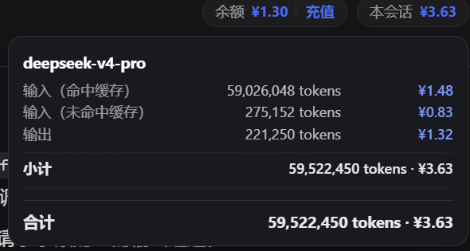

# dsh-usage-meter

想要看到自己账户的余额吗？想要看到自己一句话烧了多少钱，又不需要过多的分析功能？**想要看到涨价对自己的钱包有多大的影响？** 这个插件正适合你

在界面右上方显示DeepSeek 官方API的余额和本会话已使用的金额；鼠标悬停额度可查看按具体细节。价格表与峰谷定价可在设置页配置。

## 功能

- 会话顶部提示：
  - 余额：调用 DeepSeek 官方 `GET https://api.deepseek.com/user/balance`；非官方 API / 未配置 Key / 查询失败时余额会隐藏。
  - 本会话：显示当前 session 已使用额度（人民币，两位小数）。鼠标悬停显示明细。UI具体：

- 设置页「余额 / 用量」：余额详情、以及 **计价设置**：
  - 有峰谷定价开关，在打开开关时会按照峰谷定价的时间对每一次请求进行计算，能得到准确的金额数据，即使这次对话跨越了峰谷时段
  - 用量按 **请求发生时刻** 所在时段计价；暂时只支持官方API，未匹配的模型只显示 token 数，不计金额。

## 目录

```
dsh-usage-meter/
  package.json     插件包声明
  cordis.patch.yml bundle patch：把本插件挂载为 Cordis 宿主插件
  host.js          宿主 ESM：TypertRemoteService RPC（余额/用量/计价）
  client.js        客户端静态模块：顶部胶囊 + 设置页
  install.ps1      一键安装
  uninstall.ps1    一键卸载
  README.md
```

## 安装
**1.直接安装：** 

将这个库 git clone 到本地，然后执行其中的install.ps1脚本以安装
```powershell
cd <本插件目录>
powershell -ExecutionPolicy Bypass -File .\install.ps1
```
**2.使用npm进行安装：**

在powershell里运行：
```
dsh plugin --profile web add @hunterchcl/dsh-usage-meter
```
需保证已安装pnpm和dsh

## 卸载
运行脚本uninstall.ps1进行卸载

或者使用指令： 
```powershell
powershell -ExecutionPolicy Bypass -File .\uninstall.ps1            # 保留本机数据
powershell -ExecutionPolicy Bypass -File .\uninstall.ps1 -RemoveData # 同时删除用量/计价数据
```

## 说明与限制

- 用量为本地统计（基于 DSH session 事件日志中持久化的 usage 记录：`assistant/chunk` 与 `assistant/message`），仅供参考，非平台账单；以 DeepSeek 开放平台为准。
- 打开会话即可计算该会话完整历史用量（包括安装本插件之前的记录），按请求发生时刻的峰谷时段计价。
- 若以后在 profile 目录手动运行 `pnpm install`，可能会清理未在 `dependencies` 中声明的本地插件目录；如遇此情况请重新运行 `install.ps1`。
- 该项目遵循MIT协议开源,可自由分发和自行修改,但需要保留原版权和许可文本